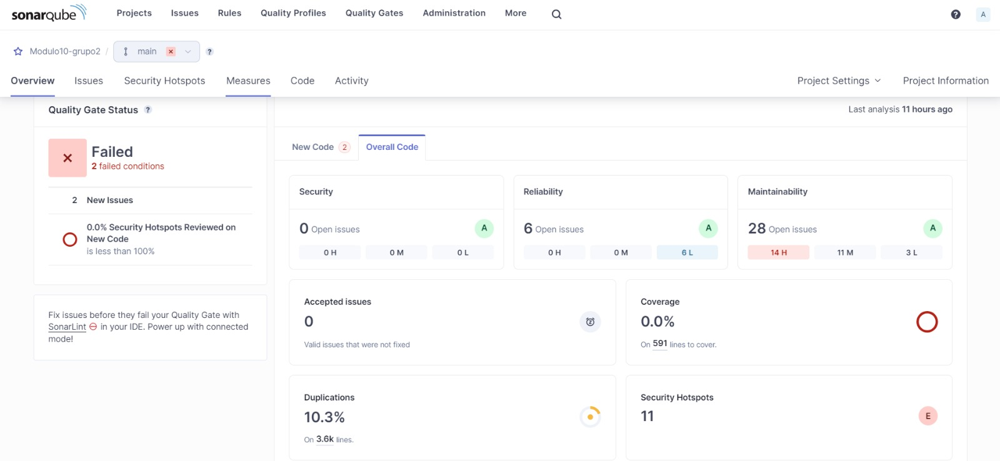
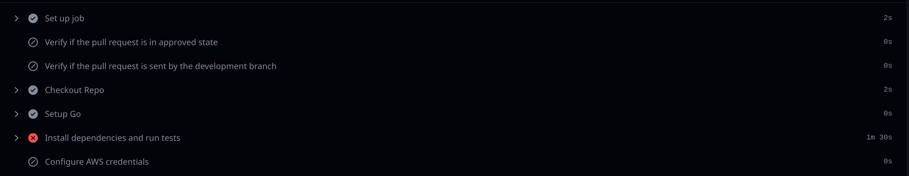

# Sumário
[1. Esteira de CI](#1-esteira-de-ci)
- [1.1 Implementação de git flow](#11-implementação-de-git-flow)
- [1.2 Revisão de código - pull request](#12-revisão-de-código---pull-request)
- [1.3 Compilação da versão presente no commit](#13-compilação-da-versão-presente-no-commit)
- [1.4 Configuração de análise estática de código](#14-configuração-de-análise-estática-de-código)
- [1.5 Execução dos testes](#15-execução-dos-testes)
# 1. Esteira de CI - Deploy Buddy
A esteira de CI para os processos de deploy automatizado da aplicação que estamos desenvolvendo funciona da seguinte maneira: 
- Criamos um arquivo YAML para o GitHub Actions que tem como função realizar a compilação do código, a análise estática e a execução dos testes. Se algum desses processos falhar, a esteira é interrompida e o deploy não é realizado. De forma mais detalhada, a esteira de CI verifica o código que está em processo de deploy e, em caso de sucesso, realiza o build do nosso Dockerfile localizado no diretório do nosso backend. Este Dockerfile é responsável por construir o backend de nossa aplicação (desenvolvida em Go) e gerar uma imagem. Como etapa final, essa imagem é enviada para o nosso ECR (Elastic Container Registry), um serviço da AWS responsável pelo armazenamento e versionamento de imagens Docker.

### 1.1 Implementação de git flow
Para que a esteira de CI seja iniciada, é necessário que o repositório siga as convenções de nomes de branches e commits estabelecidos no arquivo de [gestão de configuração](../gestão-de-configuração). 
O gitflow deve ser respeitado, pois é necessário que haja um evento de aprovação de um Pull Request vindo da branch "development" para a branch "main". Logo, não são aceitas mudanças vindas diretamente de outras branches, a não ser que sejam branches de hot-fix.

### 1.2 Revisão de código - pull request
Após a criação do Pull Request, é necessário que o PR seja aprovado por, pelo menos, duas pessoas, para que, dessa forma, seja realizado o merge com a main.

### 1.3 Compilação da versão presente no commit
O processo de CI foi configurado para compilar de forma automatizada a partir de mudanças efetuadas apenas na branch "main", não sendo aplicado a nenhuma outra branch do repositório. Logo, após ocorrer o evento de aprovações, os commits presentes no PR são aplicados à branch main, e o processo de CI continua. Dessa forma, é garantida uma integridade do código e um controle de versões seguro e íntegro.

### 1.4 Configuração de análise estática de código

#### Configuração Sonarqube

SonarQube é uma plataforma de análise de qualidade de código que proporciona uma visão detalhada da saúde do código-fonte, identificando automaticamente bugs, vulnerabilidades e outros problemas. Com uma interface de fácil uso, o SonarQube suporta várias linguagens de programação e se integra bem a diferentes ambientes de desenvolvimento, tornando-o uma ferramenta versátil para melhorar a qualidade e segurança do código.

Optar por hospedar o SonarQube em uma instância EC2 da AWS traz vantagens como alta disponibilidade, escalabilidade e flexibilidade. Isso permite que equipes acessem uma infraestrutura robusta e segura, gerenciem grandes volumes de dados e personalizem a análise de código para atender às necessidades específicas do projeto. Além disso, essa configuração facilita o acesso universal às métricas, ajudando todos os membros da equipe a monitorar e aprimorar continuamente o código.

#### 1.4.1 - Configuração da Instância EC2

1. Criação da Instância: Foi iniciada uma instância EC2 no console da AWS, escolhendo uma AMI apropriada e um tipo de instância que atenda às necessidades de recursos.
2. Configuração de Segurança: Configurar o grupo de segurança para permitir o tráfego na porta que o SonarQube utilizará (por exemplo, 9000 para acesso público).

#### 1.4.2 - Configuração do Docker e SonarQube na EC2

1. Instalar Docker na instância EC2.
    
    ```bash
    sudo apt update
    sudo apt install docker.io
    ```

2. Execução do SonarQube:
- Baixar e rodar o container do SonarQube:
            
   ```
   docker run -d --name sonarqube -p 9000:9000 sonarqube
   ```

- Comando para verificar se o container está rodando corretamente:
            
    ```
    docker ps
    ```
            

#### 1.4.3 - Conexão com o Projeto
        
   1. Integração com o Projeto:
      - Configurar o projeto para enviar análises para o SonarQube. Selecionando a linguagem e do ambiente de desenvolvimento.

   
#### 1.4.4 - Manutenção e Monitoramento
        
   1. Monitoramento do Container: Utilizar comandos do Docker para monitorar logs e performance do container do SonarQube.
      
       ```
       docker logs sonarqube
       ```

  

**Insights sprint 2**

- Status do Portão de Qualidade: Falhou
  - Condições falhadas: 2
  - Novos Problemas: 2
  - Pontos sensíveis de segurança em novo código revisados: 0.0% (o objetivo é 100%)
- Código Novo:
  - Segurança: Não há problemas abertos (Nota A)
  - Confiabilidade: 6 problemas abertos (Todos de baixa gravidade)
  - Manutenibilidade: 28 problemas abertos (14 altos, 11 médios, 3 baixos)
- Código Geral:
  - Segurança: Não há problemas abertos (Nota A)
  - Confiabilidade: Nota A com 6 problemas de baixa gravidade abertos
  - Manutenibilidade: Nota A com 28 problemas (14 altos, 11 médios, 3 baixos)
- Outras Métricas:
  - Cobertura: 0.0% em 591 linhas de código <br>
    - A cobertura de teste será coletada a partir da sprint 3, com o uso do coverage (arquivo responsável por armazenar a quantidade de código coberto por teste para leitura do Sonarqube).
  - Duplicações: 10.3% em 3.6k linhas
  - Pontos Sensíveis de Segurança: 11


### 1.5 Execução dos testes
A etapa de execução de testes é essencial para continuar a esteira de CI, e, caso os testes necessários não passem, a esteira é interrompida.

<p align="center">
    
</p>

A imagem acima representa o contexto de git flow indicado, já que somente ocorre em caso de aprovação de um Pull Request vindo da branch "development" para a branch "main". Além disso, ele conta com outras validações, como a da compilação da versão presente no commit, que no caso podem envolver diversos commits no Pull Request. Por fim, os testes da aplicação são executados com a finalidade de verificar se houve algum erro nas principais funcionalidades da aplicação e demonstra-se efetivo no exemplo, que simula um teste falho para que a Pipeline não siga adiante.

# 2 Esteira de CI - Repositório SF (SalesForce)

No caso do Salesforce, temos um processo um pouco diferente, considerando que lidamos com metadados que compõem a ORG do Salesforce. 

Atualmente, nossa aplicação, ao receber uma solicitação para subir mudanças, puxa os metadados da ORG especificada pelo usuário, cria um branch em nosso repositório de metadados e realiza o commit dos metadados (especificados pelo usuário) nesse branch. Para isso, configuramos uma esteira de CI que valida esses arquivos XML. Criamos um arquivo YAML para o GitHub Actions que tem como função validar os XMLs presentes na branch de metadados usando o xmlint. Em caso de sucesso, uma notificação é enviada aos responsáveis pelo Slack, informando que a validação foi bem-sucedida e que as modificações estão prontas para serem aplicadas na ORG do Salesforce.
