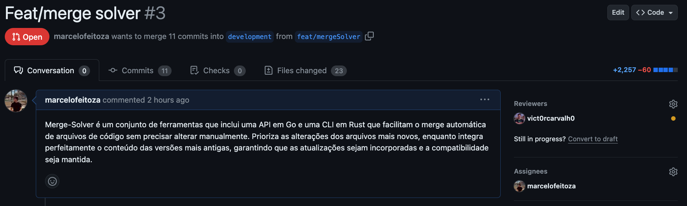

# Políticas de Gestão de Configuração

## Introdução
Este documento define as políticas de gestão de configuração para o projeto, com objetivo de garantir que todos os aspectos do desenvolvimento de software sejam gerenciados de forma coerente e controlada, facilitando a colaboração entre os membros da equipe e aumentará a eficiência do nosso processo de desenvolvimento. 

As políticas descritas aqui incluem: 
- [Fluxo de trabalho de nosso repositório](#fluxo-de-trabalho-do-repositório);
- [Nomes de Branches](#nomes-de-branches);
- [Políticas de push](#políticas-de-push);
- [Revisão de código por pares](#revisão-de-código-por-pares);
- [Validação da integridade do código-fonte](#validação-de-integridade-do-código-fonte)

## Fluxo de Trabalho do Repositório

O fluxo de trabalho do repositorio se encontra nessa página [Fluxo de Trabalho](./files/git_flow.md). Nele estão Estrutura de Branches e Fluxo de Trabalho para os dois tipos de aplicações que temos.

### Exemplo de Fluxo de Trabalho para Push

### Nomes de Branches
A escolha dos nomes para as branches é fundamental para garantir uma organização consistente e eficiente do trabalho em equipe. O padrão a ser utilizado para nomear branches é o seguinte:

- **Feature Branches**: Para o desenvolvimento de novas funcionalidades. Prefixo: `feat/`. Exemplo: `feat/adicionar-login`.
- **Fix Branches**: Para correção de bugs. Prefixo: `fix/`. Exemplo: `fix/corrigir-erro-404`.
- **Release Branches**: Para preparação de lançamentos de novas versões. Prefixo: `release/`. Exemplo: `release/1.0.0`.
- **Refactor Branches**: Para melhorias no código que não alteram funcionalidades. Prefixo: `refactor/`. Exemplo: `refactor/melhoria-estrutura-codigo`.
- **Documentation Branches**: Para alterações ou adições na documentação. Prefixo: `documentation/`. Exemplo: `documentation/atualizacao-readme`.
- **Test Branches**: Para adição ou modificação de testes. Prefixo: `test/`. Exemplo: `test/adicionar-testes-unitarios`.

### Políticas de Push

#### **Regras para Push**
Se referem às políticas e procedimentos que ditam como os pushs deverão ser feitos para o GitHub. 

- **Restrições de Branch**: Pushs diretos para a branch `main` são proibidos. Todo código deve ser desenvolvido em branches separadas e individuais seguindo o padrao em [Nomes de Branches](./files/git_flow.md#1-estrutura-de-branches).
- **Revisão de código obrigatória**: Exigir que todas as mudanças passem por revisão de código antes de serem aceitas.

## Revisão de Código por Pares

### Procedimentos para Revisão
**Iniciar uma Revisão:**

- Um desenvolvedor deve criar um pull request sempre que tiver um conjunto de alterações pronto para revisão.
- O pull request deve conter uma descrição clara das mudanças feitas, incluindo objetivos e detalhes relevantes.

**Quem Deve Realizar a Revisão:**

- A revisão de código por pares deve ser realizada por um outro membro da equipe que não tenham participado diretamente do desenvolvimento do código, tornando a revisão não enviesada, de maneira a qual o código deve se provar claro.
- Comunicação durante a Revisão:
    - Os revisores devem comunicar suas críticas, sugestões e perguntas por meio de comentários no pull request.
    - O autor do código deve responder às perguntas e ajustar o código conforme necessário.
- Resolução de Conflitos:
    - Se houver conflitos com outras alterações ou com a branch principal, eles devem ser resolvidos antes da aprovação final.
    - Os conflitos podem ser resolvidos pelo autor do código ou com a ajuda dos revisores.

### Políticas de Pull Request

Pull Requests são essenciais no nosso fluxo de trabalho, com elas facilitamos a revisão de código e integração de novas funcionalidades, correções ou documentações na branch Main de forma segura e eficiente. As seguintes políticas são estabelecidas para gerenciar os pull requests:

#### Criação de Pull Request

- **Branch de Origem**: Todos os PRs devem ser criados a partir de branches específicas para a funcionalidade, correção ou documentação (Especificados no [Nomes de branches](#nomes-de-branches)), nunca diretamente da branch `main`.
- **Descrição Detalhada**: O PR deve incluir uma descrição clara (no título e opcionalmente na descrião) do que está sendo adicionado.
- **Pequenos e Focados**: Cada PR deve ser focado em uma única funcionalidade, correção ou documnetação para facilitar a revisão e reduzir o risco de conflitos de merge.

##### Exemplo de Pull Request

Veja um exemplo de um pull request bem estruturado [aqui](https://github.com/Inteli-College/2024-1B-T03-ES10-G02/pull/3).

- **Título da PR**: `Feat/merge solver #3`
- **Descrição da PR**: `Merge-Solver é um conjunto de ferramentas que inclui uma API em Go e uma CLI em Rust que facilitam o merge automática de arquivos de código sem precisar alterar manualmente. Prioriza as alterações dos arquivos mais novos, enquanto integra perfeitamente o conteúdo das versões mais antigas, garantindo que as atualizações sejam incorporadas e a compatibilidade seja mantida.`
- **Alterações**: 23 arquivos alterados
- **Commits**: 11 commits
- **Linhas Adicionadas/Removidas**: +2,257/-60
- **Assignee**: marcelofeitoza
- **Reviewers**: vict0rcarvalh0

#### Processo de Revisão de Pull Request

- **Designação de Revisores**: Pull requests devem ser designados a pelo menos um integrante do grupo, que não esteja diretamente relacionado às mudanças realizadas, para garantir integridade.
- **Tempo de Resposta**: Os Pull Requests devem ser revisados e aceitos/recusados até a última quinta-feira da sprint.
- **Feedback Construtivo**: Os comentários durante a revisão de PR devem ser utilizados para tirar dúvidas, sugerir melhorias e apontar problemas no código.

#### Critérios de Aceitação da Pull Request

- **Aprovação dos Revisores**: Um PR só pode ser mergeado após receber aprovação do revisor. Qualquer feedback ou pedido de mudança deve ser tratado antes do merge.
- **Conflitos Resolvidos**: Antes do merge, todos os conflitos com a branch de destino devem ser resolvidos pelo autor da PR.
<!-- - **Passar em Todos os Testes**: Todos os testes automáticos configurados na pipeline de CI devem passar sem erros. -->

#### Política de Merge

**Merge**: Utilizaremos a branch `main` como branch de destino para o merge de PRs. O merge deve ser feito utilizando a opção de merge sem fast-forward para manter um histórico de commits limpo e organizado.
- **Atualização da Branch de Destino**: Antes de realizar o merge, o autor da PR deve garantir que a branch de seu PR esteja atualizada com as últimas mudanças da branch de destino para evitar problemas de integração.

#### Responsabilidades Pós-Merge

- **Monitoramento**: Após o merge, o autor da PR deve monitorar o comportamento da aplicação para garantir que não haja problemas.
- **Documentação**: Se o PR introduzir mudanças significativas que afetem a documentação do projeto, é responsabilidade do autor, ou outro responsável já atribuído, atualizar a documentação conforme necessário.

Ao aderir a estas políticas, promovemos um desenvolvimento mais organizado e eficiente, minimizando riscos e melhorando a qualidade do nosso software.

### Critérios para Aprovação
**Qualidade do Código:**

- O código deve ser claro, legível e seguir boas práticas de codificação().
- Deve conter comentários adequados para facilitar a compreensão de outros desenvolvedores.

**Testes Adequados:**

- As alterações devem incluir testes unitários e de integração apropriados para garantir que o código funcione conforme esperado. Isso se fizer sentido para o contexto e escopo da solicitação de mudança, um arquivo de configuração, por exemplo, não condiz com criação de testes.
- Testes automatizados devem passar sem falhas.

**Funcionalidade:**

- O código deve cumprir os requisitos funcionais definidos para a alteração.
- As mudanças não devem introduzir regressões ou interferir com outras funcionalidades existentes.

**Desempenho:**

- O código não deve comprometer o desempenho da aplicação.
- Se possível, deve-se otimizar o código para eficiência.

**Segurança:**

- O código deve estar livre de vulnerabilidades de segurança conhecidas, como por exemplo a exposição de variáveis de ambiente ou secret keys.

**Documentação:**

- Mudanças significativas devem ser acompanhadas de atualizações na documentação do código ou do projeto, se aplicável.

## Validação de Integridade do Código Fonte

Para assegurar que nosso código atenda aos padrões de qualidade e segurança, implementaremos uma série de procedimentos de validação de integridade do código fonte. Essas medidas são projetadas para serem integradas ao nosso fluxo de trabalho de desenvolvimento de software assim que estiverem estabelecidas.

### Testes Automatizados

**Testes Unitários**:
- Serão utilizados frameworks de testes unitários para validar cada componente do código isoladamente, assegurando que cada função e método funcione corretamente.

**Testes de Integração**:
- Testes de integração serão implementados para garantir que os componentes do sistema interajam entre si conforme esperado, proporcionando confiabilidade nas funcionalidades que dependem de múltiplos sistemas.

### Integração Contínua (CI)

**Pipelines de CI**:
- Pipelines de integração contínua (CI) serão configurados para automatizar a execução de testes e análises estáticas, garantindo que somente código verificado seja integrado.

### Revisões de Código

**Política de Revisão de Código**:
- Como parte de nosso processo de garantia de qualidade, será exigido que todas as alterações no código passem por revisões de código por pares antes da integração.

## Conclusão

Essas políticas de gestão de configuração são essenciais para garantir a qualidade e a integridade do nosso código fonte. Ao seguir essas diretrizes, podemos manter um alto padrão de desenvolvimento de software e promover a colaboração eficaz entre os membros da equipe.

