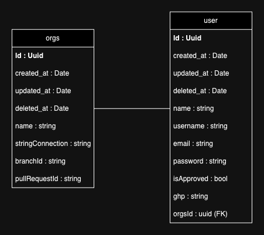

# Modelos de Dados

## Modelo de Dados Lógico

O modelo de dados lógico foi projetado para atender às necessidades funcionais e técnicas da aplicação Deploy Buddy, garantindo escalabilidade, flexibilidade e integridade dos dados. A estrutura reflete as operações de versionamento e gerenciamento de metadados essenciais para os analistas da Everymind, facilitando a gestão de ambientes de desenvolvimento, homologação e produção.

### User

#### Campos

- `ID (uuid.UUID)`: Chave primária. Utiliza UUID que é ideal para evitar conflitos em ambientes com grande escala.
- `CreatedAt (time.Time)`: Timestamp de quando o usuário foi criado. Gerenciamento automático pelo GORM.
- `UpdatedAt (time.Time)`: Timestamp de atualização do usuário. Gerenciamento automático pelo GORM.
- `DeletedAt (gorm.DeletedAt)`: Indica se o usuário foi deletado logicamente. Indexado para facilitar filtragem.
- `Name (string)`: Nome completo do usuário.
- `Username (string)`: Nome de usuário utilizado para login. Deve ser único.
- `Email (string)`: Email do usuário. Único e necessário para processos de recuperação de conta e notificações.
- `Password (string)`: Senha criptografada do usuário.
- `IsApproved (bool)`: Status que indica se o usuário foi aprovado para operações restritas.
- `GHP (string)`: Token de acesso pessoal do GitHub, utilizado para operações de integração.

#### Validations

- Validações incluem requisitos de comprimento e formato para `Name`, `Username`, `Email`, e `Password`, usando expressões regulares para garantir dados coerentes e seguros.

### Orgs

#### Campos

- `ID (uuid.UUID)`: Chave primária. Utiliza UUID para garantir unicidade global, adequado para sistemas distribuídos.
- `CreatedAt (time.Time)`: Timestamp de quando a organização foi criada. Automatizado pelo GORM.
- `UpdatedAt (time.Time)`: Timestamp de quando a organização foi atualizada pela última vez. Automatizado pelo GORM.
- `DeletedAt (gorm.DeletedAt)`: Timestamp de quando a organização foi excluída logicamente. Utiliza indexação para otimizar consultas que excluem registros deletados.
- `Name (string)`: Nome da organização. Essencial para identificação humana e operações de busca.
- `StringConnection (string)`: Dados de conexão da organização, possivelmente relacionados a integrações ou acessos externos.
- `BranchID (string)`: Identificador de um branch específico no contexto de operações de versionamento.
- `PullRequestID (string)`: Identificador de pull request, relevante para rastrear alterações específicas.

#### Validations

- A validação dos campos é realizada no contexto de API onde `Name`, `StringConnection`, `BranchID` e `PullRequestID` são obrigatórios, garantindo que a entidade esteja completa para operações de negócios.

## Modelo de Dados Físico

### Implementação com GORM

A implementação física dos modelos foi feita com GORM, um ORM para Go, que facilita a integração com o banco de dados e garante que as decisões de design lógico sejam implementadas corretamente.

- **Chaves Primárias**: Configuradas para serem UUIDs, o que é eficiente em termos de desempenho e segurança para ambientes distribuídos.
- **Índices**: Além do `DeletedAt`, poderia ser vantajoso adicionar índices para `Email` no modelo `User` e `Name` no modelo `Orgs` para acelerar consultas baseadas nesses campos.

### Otimização de Desempenho

- **UUIDs**: Embora eficientes e seguros, podem ser mais lentos para indexar do que inteiros. A otimização pode ser necessária dependendo do volume de dados.
- **Indices**: Os índices adicionais sugeridos devem ser considerados após análise de uso real para evitar sobrecarga no banco de dados.
- **Validações**: As validações aplicadas antes da inserção no banco ajudam a evitar erros de dados que poderiam degradar a performance ao longo do tempo.
