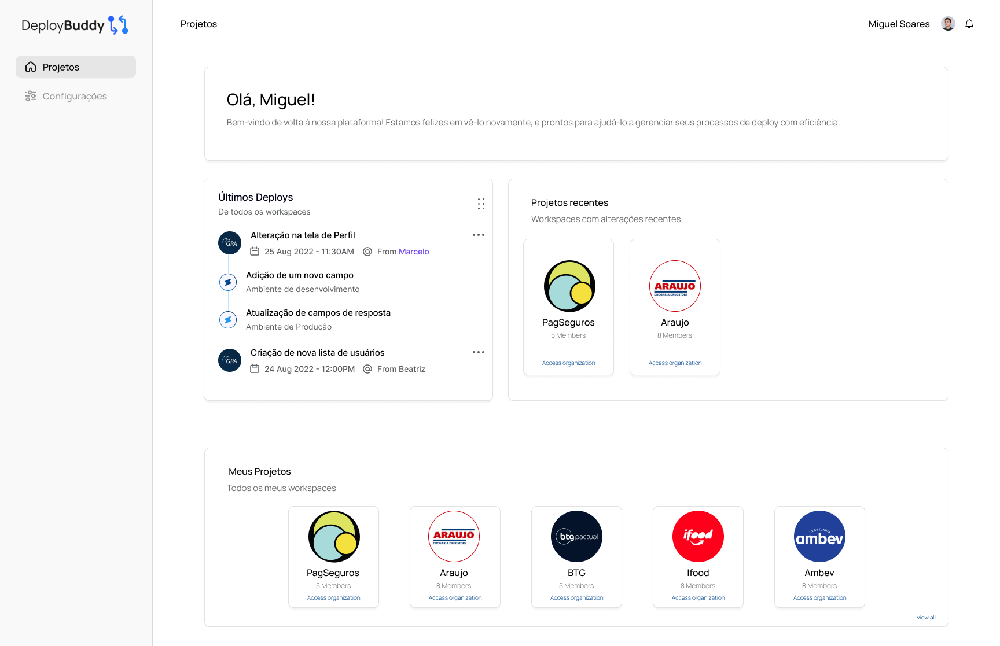
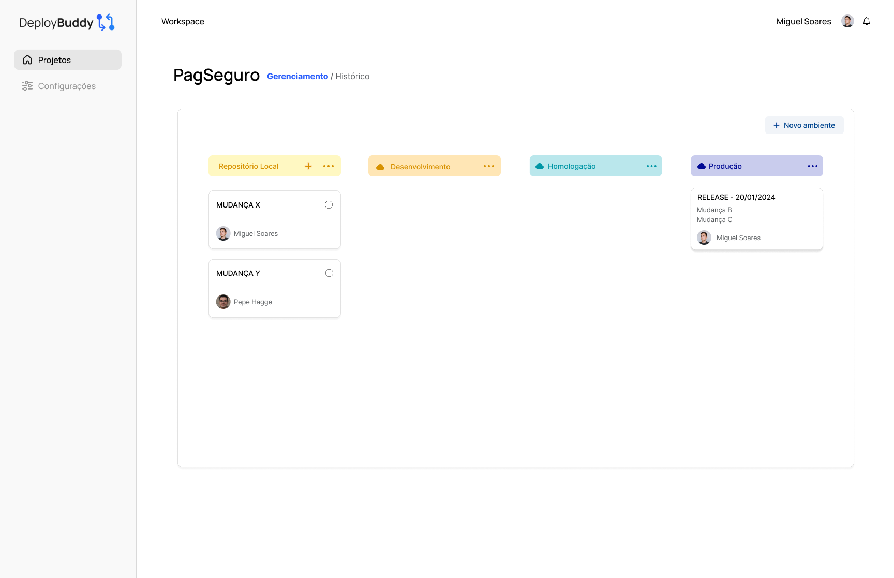
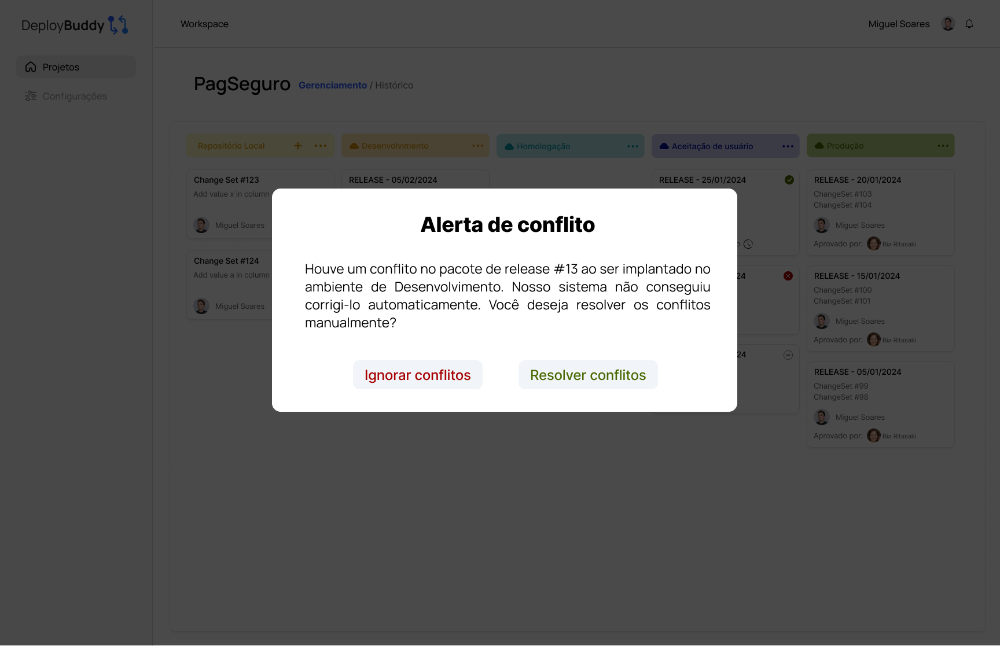
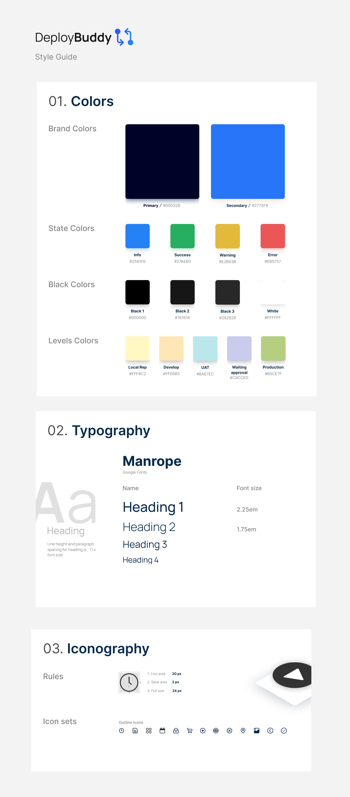

# Prototipação Visual e Guia de Estilo

## Sumário
1. [Visão Geral](#visão-geral)
2. [Objetivos do UX/UI](#objetivos-do-uxui)
3. [Diretrizes de Design](#diretrizes-de-design)
4. [Prototipação](#prototipação)
5. [Guia de Estilo](#guia-de-estilo)

## 1. Visão Geral

Esta seção documenta a prototipação visual e o guia de estilo para a solução Deploy Buddy, detalhando os elementos de design que visam proporcionar uma experiência de usuário ótima e alinhada com as melhores práticas e tendências atuais.

## 2. Objetivos do UX/UI

O design da interface do usuário e a experiência do usuário foram meticulosamente planejados para atender às necessidades específicas dos analistas da Everymind e desenvolvedores que interagem com a plataforma. O foco foi colocado em:

 **Facilidade de Uso**: Garantir que a interface seja intuitiva e fácil de navegar, reduzindo a curva de aprendizado e permitindo que os usuários comecem a trabalhar com o mínimo de treinamento.
 
 **Acessibilidade**: Design que é acessível a todos os usuários, incluindo aqueles com limitações visuais ou outras necessidades especiais.
 
 **Eficiência**: Otimização do fluxo de trabalho do usuário para maximizar a produtividade, permitindo que tarefas comuns sejam executadas de maneira rápida e eficiente.

## 3. Diretrizes de Design

As diretrizes de design foram desenvolvidas para suportar a consistência visual e funcional em toda a plataforma. Estas incluem:

 **Layout Consistente**: Os elementos de interface são organizados de forma consistente nas diversas páginas, promovendo uma experiência de usuário coesa.
 
 **Paleta de Cores**: Utilização de uma paleta de cores suave, mas distintiva, que reflete a modernidade e é agradável aos olhos, minimizando a fadiga visual em uso prolongado.
 
 **Tipografia**: Emprego de tipografia clara e legível, com tamanhos de fonte adequados para leitura e hierarquia visual bem definida.

## 4. Prototipação

Para uma visão mais detalhada acessar o arquivo Figma completo [clicando aqui.](https://www.figma.com/design/p8cF4hzhWoL1W7mPtXXbWC/DeployBuddy?node-id=0%3A1&t=hRt9LdgaM27RrRWF-1)

## 5. Guia de Estilo

Segue-se o guia de estilo visual da Deploy Buddy, que constitui um componente essencial para a manutenção da consistência e identidade visual em toda a plataforma. Este guia abrange especificações detalhadas sobre as cores, tipografia e iconografia utilizadas na interface do usuário. Ele serve como uma referência crucial para designers e desenvolvedores, assegurando que todos os elementos visuais estejam alinhados com a estética e os padrões estabelecidos para a solução Deploy Buddy.

