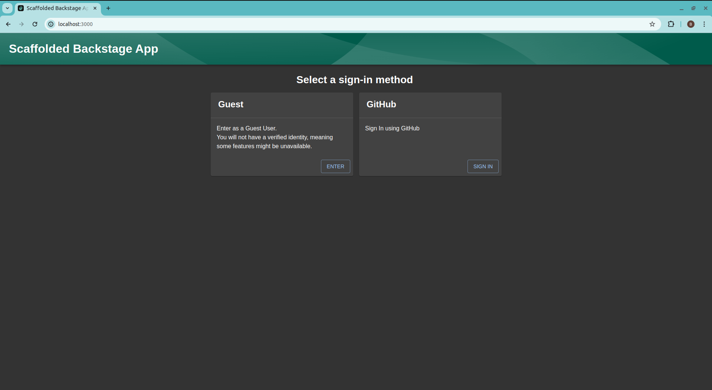
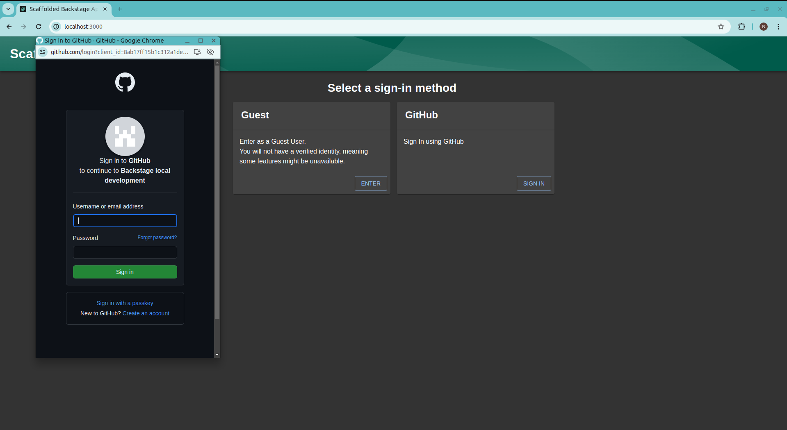
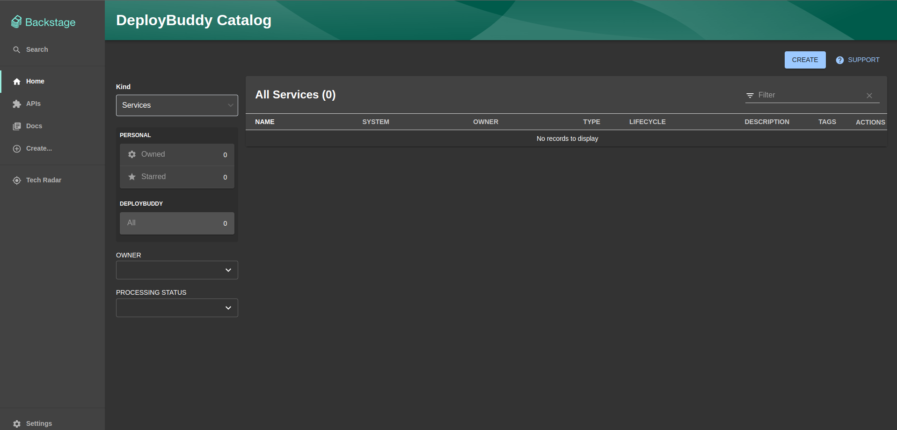
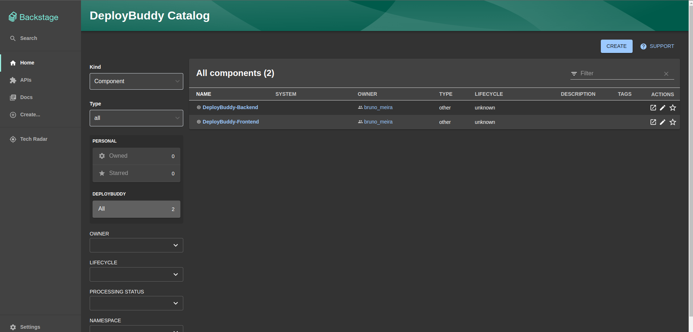
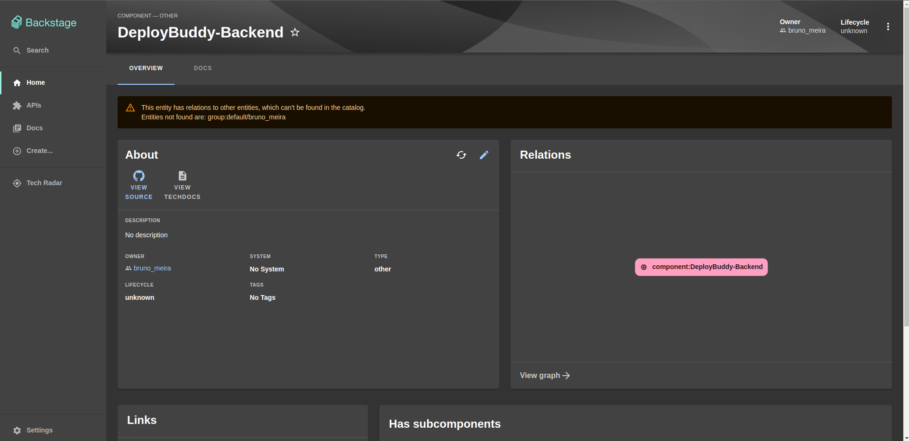

# Catalogo de serviço

## Introdução

O Backstage é uma abordagem de desenvolvimento de software que se concentra na gestão do ciclo de vida das aplicações, desde a concepção até a implementação e o monitoramento contínuo. Ele é projetado para fornecer uma plataforma centralizada para desenvolvedores, operadores e outros stakeholders colaborarem efetivamente durante todo o processo de desenvolvimento de software. Para isso, ele oferece uma interface unificada para gerenciar todos os aspectos do desenvolvimento de software, incluindo a descoberta e reutilização de componentes, a automação de fluxos de CI/CD e o monitoramento de serviços em produção.

## Beneficios do Backstage

### 1. **Centralização e Padronização:**

Com o Backstage, as equipes podem centralizar todas as ferramentas, serviços e informações relacionadas ao desenvolvimento de software em um único local. Isso promove a padronização de processos e práticas, facilitando a colaboração e reduzindo a sobrecarga de alternar entre várias ferramentas e interfaces.

### 2. **Descoberta e Reutilização de Componentes:**

Uma das vantagens-chave do Backstage é a capacidade de descobrir e reutilizar componentes de software em toda a organização. Isso promove a consistência e a eficiência, permitindo que as equipes aproveitem o trabalho já realizado por outros e evitem a duplicação de esforços.

### 3. **Automatização de Fluxos de Trabalho:**

O Backstage oferece recursos poderosos de automação para simplificar e acelerar os fluxos de trabalho de desenvolvimento. Ele pode ser integrado com pipelines de CI/CD, sistemas de gerenciamento de configuração e outras ferramentas, permitindo a automação de tarefas rotineiras e a orquestração de processos complexos.

### 4. **Visibilidade e Monitoramento:**

Ao centralizar informações sobre serviços e infraestrutura, o Backstage fornece uma visão holística do ecossistema de software. Isso permite que as equipes monitorem o desempenho e a saúde de seus serviços em tempo real, identificando e respondendo rapidamente a problemas potenciais.

### 5. **Escalabilidade e Extensibilidade:**

O Backstage é altamente escalável e extensível, adaptando-se facilmente às necessidades em evolução das equipes e organizações. Ele suporta a integração com uma ampla gama de ferramentas e serviços, permitindo que as equipes personalizem e estendam a plataforma conforme necessário.

## Criação do projeto

### Dependências:

Para instalar e executar a aplicação, há algumas dependências que precisam ser instaladas devido às tecnologias utilizadas, que são:

-   Node Js
-   Yarn
-   Docker

### Instalação

Para criar a aplicação Backstage, execute o seguinte comando na pasta raiz onde deseja que o projeto seja criado:

```
  $ npx @backstage/create-app@latest
```

Obs: Se o Backstage não estiver instalado, o processo de criação solicitará permissão para instalá-lo e em seguida continuará com o processo, pedindo o nome do aplicativo. Após a instalção ser finalizada, podemos ver, dentro do diretório atual, que foi gerado todos os arquivos e estrutura de pastas necessários para você executar o backstage.

Após a instalção bem-sucedida é necessário executar o seguinte comando para instalar todas as dependências do projeto.

```
  $ yarn install
```

## Estrutura de pastas

Segue a estrutura de pastas e arquivos atual do diretório do backstage, vale mencionar que essa estrutura contempla apenas arquivos e pastas essênciais ao entendimento completo da arquitetura.

```
├── packages
│    ├── app
│        ├── e2e-tests
│        ├── public
│        ├── src
│        ├── package.json
│    ├── backend
│        ├── src
│        ├── Dockerfile
│        ├── package.json
│        ├── README.md
│    ├── README.md
│
├── example
│    ├── template
│    ├── entities.yaml
│    ├── org.yaml
│
├── docker
│    ├── default.conf.template
│    ├── inject-config.sh
│
├── app-config.production.yaml
├── app-config.yaml
├── catalog-info.yaml
├── Dockerfile.hostbuild
├── backstage.json
├── lerna.json
├── package.json
├── README.md
```

-   app-config.yaml: Arquivo de configuração principal do aplicativo.
-   app-config.production.yaml: Arquivo de configuração principal do aplicativo para ambiente de produção.
-   package.json: Pacote de dependências do projeto
-   Dockerfile.hostbuild: Arquivo docker para deploy da aplicação frontend. (Arquivo gerado posteriormente na implantação de novos recursos e plugins)
-   packages/app: Aplicação frontend do Backstage, que funciona como ponto de partida para criação do catalogo de serviços.
-   packages/backend: Aplicação backend que ajuda a utiliza recursos como autenticação, catálogo de software, modelos de software e TechDocs e se integra com o frontend.
-   docker: Pasta com arquivos auxiliares para build e run da imagem do frontend com nginx. (Arquivos gerados posteriormente na implantação de novos recursos e plugins)

## Docker Setup

Nesta seção, será detalhado o processo de deploy dos serviços de backend e frontend em contêineres Docker, separadamente um do outro, em uma estrutura passo a passo das linhas de comando e códigos aplicados.

### Back-end

Para o backend, usaremos o arquivo Dockerfile original na pasta do backend que foi gerado pelo processo de criação do Backstage.

#### 1. **Criação de uma chave base64 para autenticação no backend:**

Gerar uma chave aleatória em formato base64 que será usada para autenticação no seu backend.

```
  $ openssl rand -base64 32
```

Após a criação e armazenamento da chave base64 é necessário configura-lá no arquivo `app-config.production.yaml` com o seguinte código dentro do bloco do `backend`:

```yaml
  auth:
    keys:
      - secret: ${YOUR_KEY}
```

#### 2. **Criação de uma rede docker:**

Criação de uma rede Docker nomeada `vnetbackstage` que será usada para conectar os três contêineres Docker do projeto (Postgres, Frontend e Backend).

```
  $ docker network create vnetbackstage
```

#### 3. **Rodar da imagem postgres:**

Iniciar um contêiner Docker com a imagem do PostgreSQL, definindo uma senha para o usuário postgres e conectando-o à rede `vnetbackstage`.

```
  $ docker run --name postgres -p 5432:5432 -e POSTGRES_PASSWORD=password --net ${ID_DOCKER_NETWORK} -d postgres
```

Obs: Certifique-se de substituir ID_DOCKER_NETWORK pela ID da rede Docker criada no passo 2, ou simplesmente use o nome da rede `vnetbackstage`.

#### 4. **Build da imagem docker:**

Criar uma imagem Docker para backend da aplicação, utilizando o Dockerfile localizado em [packages/backend/Dockerfile](https://github.com/Inteli-College/2024-1B-T03-ES10-G02/src/backstage/packages/backend) e nomeando a imagem como `backstage`. É necessário que ao realizar esse passo o backend já esteja construído através do comando `yarn build`.

```
  $ docker image build . -f packages/backend/Dockerfile --tag backstage
```

#### 5. **Rodar a imagem do backend:**

Executar o contêiner Docker com a imagem `backstage` criado anteriormente, expondo a porta 7007 do contêiner para a porta 7007 do host, e configurando variáveis de ambiente para conectar-se ao contêiner do PostgreSQL criado no passo três.

```
  $ docker run -it -p 7007:7007 --net ${ID_DOCKER_NETWORK} -e POSTGRES_HOST=postgres -e POSTGRES_PORT=5432 -e POSTGRES_USER=postgres -e POSTGRES_PASSWORD=password backstage
```

Obs: Certifique-se de substituir ID_DOCKER_NETWORK pela ID da rede Docker criada no passo 2, ou simplesmente use o nome da rede `vnetbackstage`.

### Front-end

Com essa etapa o frontend perde os recursos do plugin do `@backstage/plugin-app-backend`. Ou seja, a configuração do frontend não será mais injetada pelo backend; em vez disso, será preciso referenciar a configuração manualmente ao construir o docker frontend.

#### 1. **Criar um arquivo de configuração do servidor Nginx:**

Configuração de um servidor Nginx para servir o frontend que redireciona todas as solicitações para o `index.html` e definindo uma rota de saúde em `/healthcheck` para verificar o status da aplicação. Esse arquivo deve ser criado no diretório `docker` localizado na raiz do projeto e nomeado especificamente como `default.conf.template`

```dockerfile
  server {
    listen       $PORT;
    server_name  localhost;

    #charset koi8-r;
    #access_log  /var/log/nginx/host.access.log  main;

    location / {
        include /etc/nginx/mime.types;
        root   /usr/share/nginx/html;
        index  index.html index.htm;
        try_files $uri /index.html;
    }

    location /healthcheck {
        return 204;
    }

    #error_page  404              /404.html;

    # redirect server error pages to the static page /50x.html
    #
    error_page   500 502 503 504  /50x.html;
    location = /50x.html {
        root   /usr/share/nginx/html;
    }
}
```

#### 2. **Criar o script para injetar configurações em tempo de execução:**

Criação do script para realizar a leitura das variáveis de ambiente e injetar as configurações em tempo de execução no arquivo JavaScript principal que esta serviondo o frontend. Esse arquivo deve ser criado no diretório `docker` localizado na raiz do projeto e nomeado especificamente como `inject-config.sh`

```sh
  set -Eeuo pipefail

  function inject_config() {
    # Read runtime config from env in the same way as the @backstage/config-loader package
    local config
    config="$(jq -n 'env |
      with_entries(select(.key | startswith("APP_CONFIG_")) | .key |= sub("APP_CONFIG_"; "")) |
      to_entries |
      reduce .[] as $item (
        {}; setpath($item.key | split("_"); $item.value | try fromjson catch $item.value)
  )')"

  >&2 echo "Runtime app config: $config"

  local main_js
  if ! main_js="$(grep -l __APP_INJECTED_RUNTIME_CONFIG__ /usr/share/nginx/html/static/*.js)"; then
    echo "Runtime config already written"
    return
  fi
  echo "Writing runtime config to ${main_js}"

  # escape ' and " twice, for both sed and json
  local config_escaped_1
  config_escaped_1="$(echo "$config" | jq -cM . | sed -e 's/[\\"'\'']/\\&/g')"
  # escape / and & for sed
  local config_escaped_2
  config_escaped_2="$(echo "$config_escaped_1" | sed -e 's/[\/&]/\\&/g')"

  # Replace __APP_INJECTED_RUNTIME_CONFIG__ in the main chunk with the runtime config
  sed -e "s/__APP_INJECTED_RUNTIME_CONFIG__/$config_escaped_2/" -i "$main_js"
}

inject_config
```

#### 3. **Criar o Dockerfile do frontend::**

Definição do Dockerfile usa a imagem Nginx e instala o a dependência `jq` para processamento JSON. Após isso realiza a copia dos arquivos estáticos gerados pela build do frontend para o diretório padrão do Nginx e adiciona o script de injeção de configuração criado nos passos anteriores ao ponto de entrada do contêiner. A criação desse arquivo deve ser feita na raiz do projeto do backstage.

```dockerfile
  FROM nginx:mainline

  RUN apt-get update && apt-get -y install jq && rm -rf /var/lib/apt/lists/*

  COPY packages/app/dist /usr/share/nginx/html
  COPY docker/default.conf.template /etc/nginx/templates/default.conf.template

  COPY docker/inject-config.sh /docker-entrypoint.d/40-inject-config.sh

  ENV PORT 80
```

#### 4. **Buildar o frontend:**

Realizar o build do frontend, criando os arquivos estaticom com base no arquivo de configuração `app-config.yaml`.

```
  $ yarn workspace app build --config ../../app-config.yaml
```

#### 5. **Construir a imagem do Docker:**

Criar uma imagem Docker para o frontend, utilizando o Dockerfile criado anteriormente e nomeando a imagem como `backstage-frontend`.

```
  $ docker build -t backstage-frontend -f Dockerfile.hostbuild . 
```

#### 6. **Rodar a imagem do docker:**

Executa o contêiner Docker com a imagem `backstage-frontend`, criada no passo anterior, expondo a porta 80 do contêiner para a porta 3000 do host.

```
  $ docker run -p 3000:80 --network ${ID_DOCKER_NETWORK} backstage-frontend
```

Obs: Certifique-se de substituir `ID_DOCKER_NETWORK` pela ID da rede Docker criada no passo 2 da seção de deploy do backend usando Docker, ou simplesmente use o nome da rede `vnetbackstage`.

## Definição da autenticação via GitHub

Para realizar a autenticação no backstage pelo github foi realizado a criação de um OAuth para autenticar os usuários e permitir que nossa aplicação acesse as APIs do GitHub em nome desses usuários. Para mais detalhes da criação do OAuth acesse esse [link](https://backstage.io/docs/getting-started/config/authentication/).

### Alterações nas configurações do projeto

Para permitir que o método de autenticação do github sejá permitido na aplicação devemos alterar o arquivo de configuração `app-config.yaml` para que o Githun seja definido como um provider válido.

```yaml
  auth:
  environment: development
  providers:
    github:
      development:
        clientId: ${YOUR_CLIENT_ID}
        clientSecret: ${YOUR_CLIENT_SECRET}
    guest: {}
```

Obs: Certifique-se de substituir `YOUR_CLIENT_ID` e `YOUR_CLIENT_SECRET` pelas credenciais obtidas na criação do OAuth pelo GitHUb.

### Alterações no backend

Para essa autenticação ser bem sucedida no backend é necessário a criação de um arquivo `authModuleGithubProvider` para possibilitar a autenticação pelo GitHub no Backstage.

Neste arquivo, definimos um módulo de backend que utiliza a API do Backstage para registro de provedores de autenticação OAuth. com isso conseguimos permitir que os usuários se autentiquem na aplicação do Backstage usando as contas do GitHub.

Para uma melhor compreensão e aprofundamento desse código, recomendamos acessar o arquivo específico em seu [caminho](https://github.com/Inteli-College/2024-1B-T03-ES10-G02/src/backstage/packages/backend/src/authModuleGithubProvider.ts) de localização.

É importante esse arquivo sejam devidamente importado no arquivo principal do backend `index.ts`.

### Alterações no frontend

Para o frontend suportar a autenticação pelo github foi preciso ser feita a criação de três arquivos diferentes, abaixo segue a descrição e caminho de cada um deles:

#### 1. **plugins.ts:**

No arquivo plugins.ts, é exportado apenas o plugin signalsPlugin do pacote @backstage/plugin-signals. Ele nos da funcionalidades relacionadas a sinais e alertas no Backstage.

Para uma melhor compreensão e aprofundamento desse código, recomendamos acessar o arquivo específico em seu [caminho](https://github.com/Inteli-College/2024-1B-T03-ES10-G02/src/backstage/packages/app/src/plugins.ts) de localização.

#### 2. **AuthProxyDiscoveryApi.ts:**

Este arquivo implementa a classe que fica responsável por descobrir a URL base de um plugin com base no seu pluginId, além de lidar com a configuração do proxy de autenticação, o que é essencial para permitir o redirecionamento correto das solicitações de autenticação vindas do frontend.

Para uma melhor compreensão e aprofundamento desse código, recomendamos acessar o arquivo específico em seu [caminho](https://github.com/Inteli-College/2024-1B-T03-ES10-G02/src/backstage/packages/app/src/AuthProxyDiscoveryApi.ts) de localização.

#### 3. **identifyProviders.ts:**

Para esse arquivo é criado um array chamado providers, que contém informações sobre os provedores de autenticação disponíveis para o Backstage. No nosso caso, possuimos apenas um objeto, que representa o provedor de autenticação do GitHub, porém quando implementado dessa forma torna o processo de adição de outros métodos de autenticação mais facilitado.

Para uma melhor compreensão e aprofundamento desse código, recomendamos acessar o arquivo específico em seu [caminho](https://github.com/Inteli-College/2024-1B-T03-ES10-G02/src/backstage/packages/app/src/identityProviders.ts) de localização.

É importante que todos esse três arquivos sejam devidamente importados no arquivo principal do frontend `App.tsx`.


### Registro visual da implementação

Com esse processo bem sucedido e ao entrar no client do backstage a tela inicial já é apresentada com duas possiveis formas de autenticação na aplicação, uma por guest e outra pelo github, implementado anteriormente.

#### 1. Tela inicial do client



#### 2. Pop-up requerindo autorização para acesso ao Github



## Adição dos serviços

Quando iniciado o backstage e ter realizado o login, ele deverá se apresentar assim:



Existem duas formas de adicionar nossos serviços ao catálogo: uma é através do backstage, onde deve inserir a URL desejada e ele cria automaticamente um pull request para adicionar o arquivo de configuração ao repositório; a outra é adicioná-lo manualmente. O arquivo requer algumas alterações em suas definições, mas, de forma geral, ele se parece com isso:"

```yaml
  apiVersion: backstage.io/v1alpha1
  kind: Component
  metadata:
    name: DeployBuddy-Backend
    annotations:
      github.com/project-slug: Inteli-College/2024-1B-T03-ES10-G02
  spec:
    type: other
    lifecycle: unknown
    owner: bruno_meira
```

Após adicionar os dois serviços, eles serão adicionados a pagina inicial contendo todos os serviços registrados:



Podemos clicar em um serviço para ver mais detalhes do serviço e funcionalidades especificas do Backstage:



1. **Barra lateral esquerda** – Existem várias opções que representam diferentes seções do backstage:
   - **Home**: Leva à página inicial do catalogo, listando todos os serviços registrados.
   - **Docs**: Acesso a documentações relacionadas ao sistema e aos serviços cadastrados.
   - **Settings**: Oferece opções para configurar o serviço e a conta do usuário.

2. **Visão central – Sobre o serviço**:
   - **About**: Esta seção fornece uma descrição detalhada do serviço DeployBuddy-Backend. E inclui informações como:
     - **Source**: Indica a fonte do componente ou serviço através do link do Github.
     - **Descrição**: Fornece detalhes sobre o que o serviço faz.
     - **Owners**: Lista os proprietários do serviço.
     - **Lifecycle**: Mostra o estágio atual do ciclo de vida do serviço.
     - **Type**: O tipo de serviço.
   - **Relations**: Mostra as relações entre o serviço atual e outros componentes ou serviços. Neste exemplo, há apenas uma conexão para o componente "deploybuddy-backend".

3. **Links** – Uma seção que pode-se cadastrar links úteis relacionados ao serviço.

## Próximos passos com o Backstage

Para os próximos passos, planejamos expandir ainda mais nossos serviços, não apenas adicionando-os ao catálogo, mas também cadastrando todas as informações relacionadas a eles. Além disso, iremos explorar funcionalidades avançadas, como a integração do Backstage com pipelines de CI/CD e com os dashboards da nossa aplicação. Com isso aprimoraramos nossa eficiência operacional e conseguimos garantir a melhor gestão e monitoramento de nossos serviços possível.