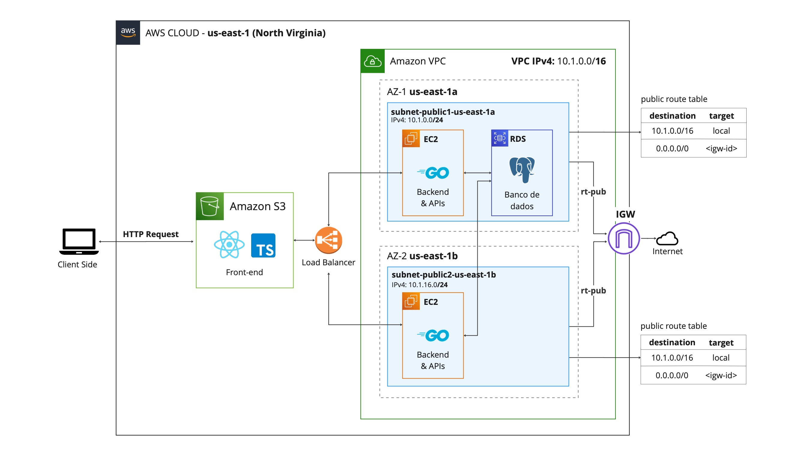

# 1. Arquitetura da solução
A solução desenvolvida está hospedada no ambiente em nuvem da AWS (Amazon Web Services), com o objetivo de garantir segurança, escalabilidade, e alta disponibilidade para a solução.

## Componentes principais

### Amazon VPC (Virtual Private Cloud)
A VPC  fornece um espaço de rede isolado na AWS, e foi configurada com um CIDR IPv4 10.1.0.0/16, dividida em duas sub-redes públicas em diferentes zonas de disponibilidade (AZ-1 e AZ-2). A utilização de duas zonas de disponibilidade é essencial para garantir a disponibilidade da aplicação, visto que elas existem fisicamente em lugares distintos. Dessa forma, se houver um problema com uma zona, a outra ainda estará de pé, mantendo a aplicação resiliente e disponível.

### Subnets (Sub-redes)
As Subnets particionam a VPC em redes menores para organizar e segregar os recursos disponíveis. Nesse caso, cada subnet foi configurada com um CIRD IPV4 10.1.0.0/24 e 10.1.16.0/24, respectivamente 

### Instâncias EC2 (Elastic Compute Cloud)
As duas instâncias EC2 são máquinas virtuais que fornecem capacidade computacional redimensionável na nuvem, e foram implantadas em ambas as sub-redes para garantir tolerância a falhas. No nosso caso, dentro de cada instância foi clonando o repositório do projeto, e está sendo rodado o backend da aplicação e a API de resolução de conflitos com Chat GPT, ambos utilizando Golang.

### Elastic Load Balancer (ELB)
O Load balancer é responsável por distribuir o tráfego de entrada entre as 2 instâncias EC2, melhorando a tolerância a falhas. Ele está situado entre o cliente e as instâncias EC2, e direciona o as requisições vindas do Frontend (em um Bucket S3) para as duas instâncias, balanceando a carga, e garantindo que as instâncias sejam usadas de maneira eficiente.

### Internet Gateway (IGW)
O Internet Gateway permite a comunicação entre instâncias na VPC e a internet. Isso é feito através da configuração de uma tabela de rotas para permitir o tráfego da internet para as sub-redes públicas.

### Bucket S3 (Simple Storage Service)
Um Bucket S3 está sendo utilizado para hospedar o Frontend da aplicação, que é servido diretamente aos clientes para reduzir a carga nas instâncias EC2 e utiliza de Typescript e React. A partir da hospedagem estática da interface, as requisições são feitas e enviadas para o Load Balancer, que direcionam para as EC2.

### RDS (Relational Database Service)
O RDS é um serviço de banco de dados relacional gerenciado, que facilita tarefas essenciais para o gerenciamento de um banco de dados (como realização de backups, recuperação, escalonamento...). A nossa instância do RDS, rodando o banco de dados PostgreSQL, foi criada em uma das sub-rede públicas (na zona us-east-1a), acessada por ambas as instâncias EC2.

## GitHub Actions Pipeline: Deployment e Gerenciamento de Infraestrutura

Esta pipeline é responsável pelo deploy e gerenciamento de infraestrutura na AWS, utilizando o AWS CloudFormation, e pela gestão de imagens Docker no Amazon ECR. Ele permite as ações de `release` e `rollback` de imagens, e é disparado manualmente através da opção `workflow_dispatch`.

[Link para o arquivo de configuração do GitHub Actions](../.github/workflows/release.yaml)

### Detalhes do Workflow

#### Triggers
- **workflow_dispatch**: Permite a execução manual do workflow através do GitHub UI, com uma escolha entre `release` e `rollback` para o tipo de ação a ser executada.

#### Jobs
- **build-and-push**: Este job executa em um ambiente Ubuntu e realiza várias tarefas desde o checkout do repositório até o deploy da infraestrutura e gestão de imagens Docker.

### Passos da Action

1. **Checkout Repo**: Utiliza a ação `actions/checkout@v2` para clonar o repositório do GitHub na máquina virtual de execução.

2. **Configure AWS credentials**: Configura as credenciais da AWS para permitir a autenticação com o AWS CLI e outros serviços da AWS. As credenciais são armazenadas como secrets no GitHub e acessadas via variáveis de ambiente.

3. **Deploy to AWS CloudFormation**: Utiliza a ação `aws-actions/aws-cloudformation-github-deploy@v1` para deploy da stack no AWS CloudFormation, especificando o template e parâmetros necessários. Importante ressaltar que as senhas e outros dados sensíveis não são armazenados no repositório.

4. **Get EC2 instance IP**: Recupera o endereço IP público da instância EC2 provisionada, utilizando o ID da instância retornado pelo CloudFormation e o AWS CLI.

5. **Login to Amazon ECR**: Autentica no Amazon ECR para permitir push de imagens Docker utilizando a ação `aws-actions/amazon-ecr-login@v1`.

6. **Determine IMAGE_TAG**: Define a tag da imagem Docker baseada no tipo de ação selecionada (`release` ou `rollback`), atualizando a variável de ambiente `IMAGE_TAG`.

7. **Delete Existing Image**: Deleta a imagem Docker existente no repositório do ECR com a tag especificada, se necessário.

8. **Verifies**: Exibe o registro ECR e a tag da imagem para verificação.

9. **Build the Docker image**: Cria a imagem Docker usando o `Dockerfile` em `src/server`.

10. **Push the Docker image to Amazon ECR**: Faz o push da imagem Docker para o repositório no Amazon ECR.

11. **Set up SSH Connection**: Configura a conexão SSH para a instância EC2, salvando a chave privada SSH em `~/.ssh/id_rsa` e adicionando o IP da instância aos hosts conhecidos.

12. **Access EC2 instance**: Acessa a instância EC2 via SSH e executa um script utilizando o tipo de ação como argumento.

### Segurança e Práticas Recomendadas

- **Gerenciamento de Secrets**: Todas as credenciais são gerenciadas de forma segura usando GitHub Secrets, garantindo que informações sensíveis não sejam expostas no código.
- **SSH Key Management**: As chaves SSH são configuradas dinamicamente e nunca armazenadas de forma insegura.
- **Clean-up Actions**: As imagens Docker são gerenciadas de forma a evitar o acumulo de imagens antigas ou desnecessárias no ECR.

